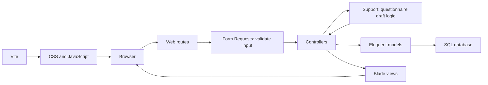

# Application Architecture

Source review: 7 October 2026. Related: [[03 Programmier-Stack|Programmier-Stack]], [[05 Entity Relationship Model|Entity Relationship Model]], [[07 Implementation Status|Implementation Status]].

## Structure

The application uses Laravel with server-rendered Blade pages. `routes/web.php` defines web endpoints; controllers in `app/Http/Controllers` process requests; Eloquent models in `app/Models` access the relational database. Migrations in `database/migrations` define constraints. Vite builds `resources/css/app.css` and `resources/js/app.js`.

Validation lives in `app/Http/Requests`; questionnaire draft manipulation lives in `app/Support/QuestionnaireDraft.php`. Views are grouped into `pages`, `components`, and `layouts`. Route names use resource prefixes (`courses.index`, `sessions.create`, `users.index`, `feedback.show`), while existing URLs remain unchanged.

## Requests and supporting logic

`app/Http/Requests` contains Laravel Form Request classes. Laravel validates these requests before running the controller action that receives them. Each class defines the accepted fields and their rules; `after()` callbacks handle checks that need related records. For example, `StoreCourseSessionRequest` checks that the course and instructor exist, the dates are valid, and the instructor is approved and has the instructor role. Invalid web form input redirects back with validation errors and previous input. Controllers access the validated fields through `$request->validated()`.

The request classes cover registration, login, user role updates, session creation, questionnaire drafts and saving, and public feedback. `QuestionnaireRequest` shares the editor's common rules with its preview and save requests. `FeedbackCodeRequest` validates the query-string code and resolves the existing form and template; its submission subclass also validates answers, options and comments. Endpoint authorization remains in route middleware and shared gates.

`app/Support` contains supporting application logic that does not handle HTTP directly. Currently, `QuestionnaireDraft` creates the initial empty questionnaire and applies editor actions: adding or removing questions and options, refreshing answer types, and enforcing draft limits. It accepts validated data and returns an updated draft without writing to the database. Invalid draft actions raise validation errors that Laravel displays on the form.

Interface strings use Laravel translation helpers and German/English language files; German is the default locale. `SetLocale` applies the validated preference cookie after cookie decryption. `LanguageController` handles CSRF-protected language changes and local-only return paths. All stored questionnaire content and participant responses retain their original wording in every locale. See [[10 Localization|Localization]].

For an editor preview, the flow is: `PreviewQuestionnaireRequest` validates input, `QuestionnaireTemplateController::preview` passes it to `QuestionnaireDraft::apply`, and the controller renders the editor with the updated draft. For a save action, the request validates input and the controller uses models to persist it, then returns a redirect. This keeps controllers focused on coordinating the request and response.

## Route map

Paths and handler names below match the repository.

| Method | Path                      | Handler                                    | Access in current code                      |
| ------ | ------------------------- | ------------------------------------------ | ------------------------------------------- |
| GET    | `/`                       | `pages.home.index` view                    | Public                                      |
| GET    | `/register`, `/login`     | Registration/login views                   | Public                                      |
| POST   | `/register`               | `AuthController::register`                 | Public                                      |
| POST   | `/login`                  | `AuthController::login`                    | Public; throttle `5,1`                      |
| POST   | `/logout`                 | `AuthController::logout`                   | Authenticated                               |
| GET    | `/questionnaire?code=…`   | `FeedbackResponseController::show`         | Public; six-digit code lookup               |
| POST   | `/questionnaire?code=…`   | `FeedbackResponseController::store`        | Public; existing form lookup                |
| GET    | `/overview`               | `CourseSessionController::index`           | Authenticated; user must have a role        |
| GET    | `/session/create`         | `CourseSessionController::create`          | Authenticated                               |
| POST   | `/session`                | `CourseSessionController::store`           | Authenticated                               |
| GET    | `/courses`                | `CourseController::index`                  | Authenticated; user must have a role        |
| GET | `/courses/create` | `CourseController::create` | Admin/editor |
| POST | `/courses` | `CourseController::store` | Admin/editor; validated course creation |
| GET | `/courses/{course}/edit` | `CourseController::edit` | Admin/editor |
| PATCH | `/courses/{course}` | `CourseController::update` | Admin/editor; validated update |
| GET | `/session/{courseSession}/edit` | `CourseSessionController::edit` | Admin/editor |
| PATCH | `/session/{courseSession}` | `CourseSessionController::update` | Admin/editor; instructor/date update |
| PATCH | `/session/{courseSession}/evaluation` | `CourseSessionController::updateEvaluationStatus` | Admin/editor |
| GET    | `/questionnaires`         | `QuestionnaireTemplateController::index`   | Authenticated with a role; instructor session usage scoped to ownership |
| GET    | `/questionnaires/create`  | `QuestionnaireTemplateController::create`  | Admin/editor                               |
| POST   | `/questionnaires/preview` | `QuestionnaireTemplateController::preview` | Admin/editor; draft changes only           |
| POST   | `/questionnaires`         | `QuestionnaireTemplateController::store`   | Admin/editor; persistent template creation |
| GET | `/session/{courseSession}/results` | `EvaluationResultsController::show` | Admin/editor or assigned instructor |
| DELETE | `/delete/{courseSession}` | `CourseSessionController::delete` | Administrator; transactional feedback cleanup |
| DELETE | `/courses/{course}` | `CourseController::delete` | Administrator; transactional session cleanup |
| GET | `/questionnaires/{template}/duplicate` | `QuestionnaireTemplateController::duplicate` | Admin/editor; no database writes |
| DELETE | `/questionnaires/{template}` | `QuestionnaireTemplateController::delete` | Administrator; assigned templates blocked |
| GET    | `/users`                  | `UserController::index`                    | Administrator                               |
| PATCH  | `/users/{user}`           | `UserController::update`                   | Administrator                               |
| DELETE | `/users/{user}`           | `UserController::destroy`                  | Administrator; cannot delete self           |

Web forms use CSRF tokens. Shared `view-course-lists` and `manage-users` gates are applied through route middleware; the navigation uses the same user-management gate. Self-deletion remains guarded in the controller. Role permission columns do not constitute comprehensive endpoint authorization.

## Registration and administration

Registration validates names, unique email and a confirmed password of at least eight characters. The database supplies the default instructor role and unapproved state. Passwords use the model's hashed cast. Login requires approval, regenerates the session and redirects to the intended page. Logout invalidates the session and regenerates its CSRF token.

Administrators can approve a pending account while assigning its role, change approved users' roles, and delete users without assigned sessions. Deleting an assigned instructor returns a reassignment message. A self-demotion redirects the administrator to the home page.

## Participant feedback

1. The home page sends the entered code to `GET /questionnaire`.
2. The controller finds an existing feedback form and resolves its session's saved template. Invalid code format produces validation errors; unknown codes or missing session templates return 404. The course's current template is not used as a fallback.
3. Questions render in template position order, with radio options or free-text inputs and optional comments.
4. Submission sends `answers[question_id]` and `answers_comment[question_id]` to the same path using POST.
5. The controller creates answer records on the existing form and redirects home with a one-time confirmation.

Participant answers are now optional in the browser. Tests cover skipped questions and blank free-text submissions. The incomplete-answer JavaScript warning has been removed. There is no separate review step or draft storage. Opening the page does not create answer records; feedback forms and their codes already exist. Comments alone are not processed because submission iterates the answer array.

Repeated submissions append answers to the same form. The code is not consumed, and there is no submitted flag. Form Requests validate the query code, payload arrays, answer types and lengths, question/template membership, option/question membership and whether comments are allowed. Answer writes use one database transaction. Both questionnaire access and submission require an open evaluation. Closing clears its access code while preserving the feedback form and collected answers. See [[07 Implementation Status|Implementation Status]] for the resulting requirement gaps.

## Sessions and overview

Session creation selects an existing course and approved instructor, validates dates and creates the session. The model stores numeric `session_number` values and assigns the next number within each course. The computed `session_identifier` combines the current course name and a minimum three-digit number, for example `AID.002`. A unique `(course_id, session_number)` constraint prevents duplicates within a course; concurrent generation still needs locking/retry. Renaming a course changes its displayed session identifiers. The forward migration `2026_10_07_000001_replace_course_session_number_with_session_number` numbers existing sessions in ID order within each course and removes the old stored identifier. Creation does not immediately generate feedback forms or codes; opening an evaluation does.

The overview loads visible sessions, their courses, instructors, saved session templates and each session's optional feedback form. Instructors receive only their own sessions; admins and editors receive all sessions and can use course/instructor filters. Cards show dates and status; modals expose details and existing feedback codes. Session detail dialogs link to the authorized evaluation results page.

### Session questionnaire assignment

`course_sessions.questionnaire_template_id` stores the questionnaire used by the session. The `CourseSession` creation hook copies the course's current template when no explicit template attribute is supplied, including factory/demo creation. HTTP session creation does not accept a template ID from the client. Changing the course default affects new sessions only. Feedback display, submission validation and session cards use `CourseSession::questionnaireTemplate()`.

The original domain-table migration defines a nullable template foreign key on sessions with restricted deletion. This schema change assumes a fresh database migration; there is no incremental migration or backfill. This preserves template assignment, not question contents: editing/deleting used questions and options or changing a session's template still needs separate protection/versioning.

## Automatic evaluation status

`evaluations:update-statuses` runs hourly through Laravel's scheduler in `EVALUATION_TIMEZONE` (default `Europe/Zurich`). It opens sessions whose start date is today and closes sessions whose end date was exactly 14 days ago. Closing happens on the fourteenth day, not after that day finishes. Sessions with an unset (`null`) status also open if their start date has passed and their closing deadline has not arrived. This handles late-created sessions and missed opening runs without reopening manually closed sessions on later dates. Missed closing days still require a manual status update.

Both the scheduled command and the authorized manual update use `app/Actions/SetEvaluationStatus.php`. Matching statuses are ignored. Status changes and access codes are saved in one transaction with a session row lock: opening creates the form if needed and generates a unique six-digit code, while closing clears only the code. Code collisions are retried. Neither transition deletes answers. Manual changes on a boundary day can be superseded by a subsequent hourly run on that same day.

The evaluation update route uses the `manage-evaluations` gate for administrators and editors. `composer dev` starts `schedule:work` alongside the server and frontend. Production hosts must run `php artisan schedule:run` every minute; see [[06 Development Setup|Development Setup]].

## Courses

The course overview lists courses with their default questionnaire and visible session counts/details. Instructors see only their own sessions within each course; admins/editors see all. Course creation and editing are restricted to admins/editors. Both pages reuse `components/courses/form-fields.blade.php`, restore old input and validate unique names and existing templates. Updates ignore the course's own name for uniqueness and change only the default for new sessions. Course modals link to session creation with the course selected and to visible session details.

## Questionnaire editor and library

The library lists persisted templates with question counts, newest first. The editor starts with one single-choice question and two options. Preview POST requests add/remove questions and options or refresh answer types without database writes. It retains at least one question and two single-choice options, with limits of 50 questions and 20 options per question. JavaScript automatically submits type changes and restores scroll/focus using sessionStorage; a refresh button remains available without JavaScript.

Saving validates the template name, question text/type, optional comment setting and single-choice options, then creates the template, ordered question pivot records and options within a database transaction. Limits are 255 characters for the name, 5,000 for question text and 1,000 per option; single-choice questions require at least two options. Optional comments default to disabled and can be enabled per question. Save redirects to the database-backed library with confirmation.

The library requires authentication. Creation, draft refresh and saving additionally require `create-questionnaires` (admins/editors). Duplicate and edit opens the creation editor prefilled with the saved template. Saving creates independent questions/options and a new template; opening the editor does not write records. Admin-only deletion rejects templates assigned to any course or session, removes their pivot rows, and deletes only questions/options that are neither shared nor referenced by stored answers. Direct editing of saved templates and versioning remain unfinished. This editor preview concerns questionnaire design; it is not the participant answer-review step required before feedback submission.

## Shared forms and permissions

Course forms share their name/template fields. Session forms share instructor and date fields; course/template are read-only on edit. `CourseSessionRequest` validates approved instructors and date ordering; its creation subclass adds course validation and instructor self-assignment enforcement, while its update subclass accepts only instructor/dates. Session updates require `edit-sessions` and preserve template, course, number and evaluation status. Date edits do not immediately recalculate evaluation status; the scheduled process uses the saved dates.

Role names are the authorization source of truth. `User::hasRole()` supplies shared role checks, while gates retain separate names for creating/editing courses/questionnaires/sessions, session filters, workflow guidance, user administration and evaluation controls. Unused boolean role permission columns were removed from the original schema for fresh migration.

## Questionnaire usage and detail navigation

Questionnaire preview dialogs show assigned courses and sessions, with feedback-received badges based on whether answers exist. Questions and session lists are collapsed initially. Course and session links use `courses.index?course=ID` and `sessions.index?session=ID`; JavaScript opens only an existing matching detail modal. Session links are restricted to admins/editors or the assigned instructor. The questionnaire library requires a role and scopes the session eager-load query to the signed-in instructor's own sessions before loading their courses, feedback forms and answers. Session counts and feedback badges therefore contain only visible sessions; admins/editors retain all-session visibility. Questionnaire definitions and course assignments remain shared library information. Instructors receive an ownership-specific empty-state message.

## Evaluation results and printing

`GET /session/{courseSession}/results` uses `EvaluationResultsController::show`, retains route name `sessions.results`, and requires authentication plus `view-evaluation-results`. Admins/editors can view all sessions; instructors can view only their own. The controller loads the session's saved questionnaire, ordered questions/options and feedback answers, then prepares per-option totals, nonblank written responses and comments.

Single-choice results use server-rendered SVG pie charts with counts and percentages. Each percentage uses the total selected options for that question; it is not a participant or submission count. Empty charts show a no-answers state, and a single populated option renders a full circle. Written answers and comments remain escaped text in the full screen view.

Print / Save as PDF invokes browser printing. Print CSS requests portrait A4 with 10 mm margins and a compact two-column summary. Navigation, controls, individual written responses and comments are excluded; free-text questions show response counts. The layout targets the standard ten-question questionnaire. One-page fit has not been verified in print preview; long custom questionnaires or labels may span pages. Browser PDF saving is not a server-generated PDF export.

## Administrative deletion

Course and session deletion use separate admin-only Gates in routes and controllers and require frontend confirmation. Within a transaction, session deletion removes its feedback form first (answers cascade at the database level), then the session. Course deletion removes each session's form and session, then the course. Shared templates, questions, options and instructors remain intact. The underlying course/session foreign keys still restrict direct parent deletion; these cascades are implemented by controller transactions rather than changed schema rules. Individual submitted feedback deletion remains unfinished.

## CSV imports

Admin-only settings routes expose an import selection page and course/session uploads. Upload authorization and file validation live in `ImportCoursesRequest` and `ImportSessionsRequest`. `CsvImportReader` streams normalized CSV records and closes the handle reliably. Import controllers validate each record separately, resolve existing relationships and report failed records while creating valid ones. Session writes lock the course row in a transaction. See [[08 CSV Imports|CSV Imports]] for formats and retry semantics.

## Password reset

Guest-only routes delegate link requests and password changes to `PasswordResetController`, using `ForgotPasswordRequest` and `ResetPasswordRequest`. Laravel's password broker manages token storage, expiry and consumption. Both POST routes are rate-limited; account approval remains unchanged. Operational logs record broker statuses, and the auth layout displays feedback. See [[09 Password Reset|Password Reset]] for setup and tests.
