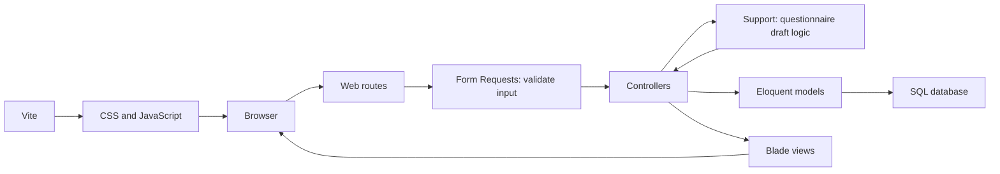

# Application Architecture

Source review: 6 October 2026. Related: [[03 Programmier-Stack|Programmier-Stack]], [[05 Entity Relationship Model|Entity Relationship Model]], [[07 Implementation Status|Implementation Status]].

## Structure

The application uses Laravel with server-rendered Blade pages. `routes/web.php` defines web endpoints; controllers in `app/Http/Controllers` process requests; Eloquent models in `app/Models` access the relational database. Migrations in `database/migrations` define constraints. Vite builds `resources/css/app.css` and `resources/js/app.js`.

Validation lives in `app/Http/Requests`; questionnaire draft manipulation lives in `app/Support/QuestionnaireDraft.php`. Views are grouped into `pages`, `components`, and `layouts`. Route names use resource prefixes (`courses.index`, `sessions.create`, `users.index`, `feedback.show`), while existing URLs remain unchanged.

## Requests and supporting logic

`app/Http/Requests` contains Laravel Form Request classes. Laravel validates these requests before running the controller action that receives them. Each class defines the accepted fields and their rules; `after()` callbacks handle checks that need related records. For example, `StoreCourseSessionRequest` checks that the course and instructor exist, the dates are valid, and the instructor is approved and has the instructor role. Invalid web form input redirects back with validation errors and previous input. Controllers access the validated fields through `$request->validated()`.

The request classes cover registration, login, user role updates, session creation, questionnaire drafts and saving, and public feedback. `QuestionnaireRequest` shares the editor's common rules with its preview and save requests. `FeedbackCodeRequest` validates the query-string code and resolves the existing form and template; its submission subclass also validates answers, options and comments. Endpoint authorization remains in route middleware and shared gates.

`app/Support` contains supporting application logic that does not handle HTTP directly. Currently, `QuestionnaireDraft` creates the initial empty questionnaire and applies editor actions: adding or removing questions and options, refreshing answer types, and enforcing draft limits. It accepts validated data and returns an updated draft without writing to the database. Invalid draft actions raise validation errors that Laravel displays on the form.

For an editor preview, the flow is: `PreviewQuestionnaireRequest` validates input, `QuestionnaireTemplateController::preview` passes it to `QuestionnaireDraft::apply`, and the controller renders the editor with the updated draft. For a save action, the request validates input and the controller uses models to persist it, then returns a redirect. This keeps controllers focused on coordinating the request and response.

## Route map

Paths and handler names below match the repository.

| Method | Path                      | Handler                                    | Access in current code                      |
| ------ | ------------------------- | ------------------------------------------ | ------------------------------------------- |
| GET    | `/`                       | `pages.home.index` view                    | Public                                      |
| GET    | `/register`, `/login`     | Registration/login views                   | Public                                      |
| POST   | `/register`               | `AuthController::register`                 | Public                                      |
| POST   | `/login`                  | `AuthController::login`                    | Public; throttle `5,1`                      |
| POST   | `/logout`                 | `AuthController::logout`                   | Authenticated                               |
| GET    | `/questionnaire?code=…`   | `FeedbackResponseController::show`         | Public; six-digit code lookup               |
| POST   | `/questionnaire?code=…`   | `FeedbackResponseController::store`        | Public; existing form lookup                |
| GET    | `/overview`               | `CourseSessionController::index`           | Authenticated; user must have a role        |
| GET    | `/session/create`         | `CourseSessionController::create`          | Authenticated                               |
| POST   | `/session`                | `CourseSessionController::store`           | Authenticated                               |
| GET    | `/courses`                | `CourseController::index`                  | Authenticated; user must have a role        |
| GET | `/courses/create` | `CourseController::create` | Authenticated |
| POST | `/courses` | `CourseController::store` | Authenticated; validated course creation |
| GET    | `/questionnaires`         | `QuestionnaireTemplateController::index`   | Authenticated                               |
| GET    | `/questionnaires/create`  | `QuestionnaireTemplateController::create`  | Authenticated                               |
| POST   | `/questionnaires/preview` | `QuestionnaireTemplateController::preview` | Authenticated; draft changes only           |
| POST   | `/questionnaires`         | `QuestionnaireTemplateController::store`   | Authenticated; persistent template creation |
| GET    | `/users`                  | `UserController::index`                    | Administrator                               |
| PATCH  | `/users/{user}`           | `UserController::update`                   | Administrator                               |
| DELETE | `/users/{user}`           | `UserController::destroy`                  | Administrator; cannot delete self           |

Web forms use CSRF tokens. Shared `view-course-lists` and `manage-users` gates are applied through route middleware; the navigation uses the same user-management gate. Self-deletion remains guarded in the controller. Role permission columns do not constitute comprehensive endpoint authorization.

## Registration and administration

Registration validates names, unique email and a confirmed password of at least eight characters. The database supplies the default instructor role and unapproved state. Passwords use the model's hashed cast. Login requires approval, regenerates the session and redirects to the intended page. Logout invalidates the session and regenerates its CSRF token.

Administrators can approve a pending account while assigning its role, change approved users' roles, and delete users without assigned sessions. Deleting an assigned instructor returns a reassignment message. A self-demotion redirects the administrator to the home page.

## Participant feedback

1. The home page sends the entered code to `GET /questionnaire`.
2. The controller finds an existing feedback form and resolves its course's assigned template. Invalid code format produces validation errors; unknown codes or missing templates return 404.
3. Questions render in template position order, with radio options or free-text inputs and optional comments.
4. Submission sends `answers[question_id]` and `answers_comment[question_id]` to the same path using POST.
5. The controller creates answer records on the existing form and redirects home with a one-time confirmation.

Participant answers are now optional in the browser. Tests cover skipped questions and blank free-text submissions. The incomplete-answer JavaScript warning has been removed. There is no separate review step or draft storage. Opening the page does not create answer records; feedback forms and their codes already exist. Comments alone are not processed because submission iterates the answer array.

Repeated submissions append answers to the same form. The code is not consumed, and there is no submitted flag. Form Requests validate the query code, payload arrays, answer types and lengths, question/template membership, option/question membership and whether comments are allowed. Answer writes use one database transaction. Evaluation-window enforcement remains unfinished. See [[07 Implementation Status|Implementation Status]] for the resulting requirement gaps.

## Sessions and overview

Session creation selects an existing course and approved instructor, validates dates and creates the session. The model generates `COURSE.0001`-style identifiers by scanning existing numbers. The unique database constraint prevents duplicate stored identifiers, but concurrent number generation has no locking/retry mechanism. Creation does not generate feedback forms or codes.

The overview loads all sessions, their instructors, course templates and each session's optional feedback form. The model exposes feedbackForm() as a has-one relation and the schema makes course_session_id unique in feedback_forms. Cards show dates and status; modals expose details and existing feedback codes. Course and instructor selectors combine filters in JavaScript using exact IDs. Filtering hides cards already sent to the browser and does not provide server-side access control. No aggregate answer results are displayed.

## Courses

The course overview loads every course with its questionnaire template, session count and sessions/instructors. It requires an authenticated user with a role but does not scope records by instructor. The course creation page lists questionnaires alphabetically and restores the name and selected questionnaire after validation errors. `StoreCourseRequest` requires a unique name of up to 255 characters and an existing questionnaire template. Saving creates the course and redirects to the course list with confirmation. When no questionnaires exist, the form disables creation and links to the questionnaire editor. Course creation does not create sessions; course editing remains unfinished.

## Questionnaire editor and library

The library lists persisted templates with question counts, newest first. The editor starts with one single-choice question and two options. Preview POST requests add/remove questions and options or refresh answer types without database writes. It retains at least one question and two single-choice options, with limits of 50 questions and 20 options per question. JavaScript automatically submits type changes and restores scroll/focus using sessionStorage; a refresh button remains available without JavaScript.

Saving validates the template name, question text/type and single-choice options, then creates the template, ordered question pivot records and options within a database transaction. Limits are 255 characters for the name, 5,000 for question text and 1,000 per option; single-choice questions require at least two options. New questions always have allows_comment=false. Save redirects to the database-backed library with confirmation.

All editor/library routes currently require authentication only. Administrator authorization, editing/deleting saved templates, configurable comments and changing existing course assignments remain unfinished. This editor preview concerns questionnaire design; it is not the participant answer-review step required before feedback submission.
