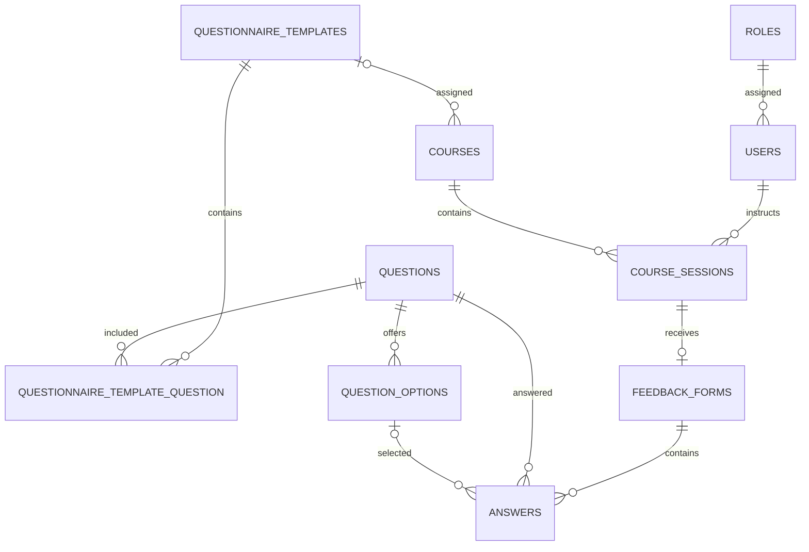

# Entity Relationship Model

This document describes the implemented database schema as of 5 October 2026. Project requirements describe the intended functionality separately.

Related: [[01 Documentation Index|Documentation Index]], [[04 Application Architecture|Application Architecture]] and [[07 Implementation Status|Implementation Status]].

## Overview

The application stores users and roles, courses and scheduled course sessions, reusable questionnaires, anonymous feedback forms and individual answers. Laravel migrations define the schema and Eloquent models expose its relationships.

Participants do not require user accounts. Feedback forms have no participant/user foreign key. This describes the database structure; it does not establish anonymity of infrastructure logs or externally maintained code-distribution records.

## Entities

All main entity tables have an `id` primary key and Laravel `created_at`/`updated_at` timestamps. Pivot fields are described separately.

### Role and User

`roles` defines application roles. The application uses `instructor`, `editor` and `admin` names.

The table also stores boolean `see_overview`, `update`, `delete`, `assign_roles` and `approve_registrations` flags. Migrations and `RoleSeeder` enable overview/update for editors and administrators, and deletion/role assignment/approval for administrators. Current controller authorization does not consistently consult these flags; the overview accepts any user with a role.

`users` stores `role_id`, `first_name`, `last_name`, unique `email`, hashed `password`, and `is_approved`, alongside authentication fields such as `email_verified_at` and `remember_token`. The `User` model exposes `name` as a computed combination of first and last name, rather than a separate name column. Password hashing is handled through the model's hashed cast.

A role has many users. A user belongs to a role and can be assigned as instructor to many course sessions. Registration creates an unapproved account; login requires approval. Administrator user management assigns roles and approves accounts.

### Course

| Field | Meaning |
|---|---|
| `name` | Unique course name |
| `questionnaire_template_id` | Nullable reference to the assigned questionnaire template |

There is no separate course `code` column. One course has many course sessions. Multiple courses can reference the same questionnaire template.

### Course Session

| Field | Meaning |
|---|---|
| `course_id` | Required course reference |
| `instructor_id` | Required reference to a user |
| `course_session_number` | Unique session identifier |
| `start_date` | Session start date |
| `end_date` | Session end date |
| `evaluation_status` | Nullable enum: `open` or `closed` |

Each session belongs to one course and one instructor and has at most one feedback form. If no session number is supplied, the model generates a number such as `COURSE.0001` by scanning existing numbers. Session creation validates that the instructor is approved and has the instructor role, and that the end date is not before the start date.

The migration describes null status as automatic mode and explicit values as manual overrides. The current controller/model does not calculate the automatic date window or enforce it when feedback is accessed/submitted. The overview displays null as “Evaluation status not set”.

### Questionnaire Template

`questionnaire_templates` stores the template `name`. It has no description column. A template has many questions through the `questionnaire_template_question` pivot and can be assigned to many courses.

### Question

| Field | Meaning |
|---|---|
| `question_text` | Displayed question text |
| `type` | Enum: `single_choice` or `free_text` |
| `allows_comment` | Boolean indicating comment support |

A question can belong to multiple templates and have multiple possible options. Multiple simultaneous selected options are not represented by this schema. The standard ten-question questionnaire is defined in `QuestionnaireSeeder`.

### Question Option

`question_options` stores `question_id` and `option_text`. Each option belongs to one question. A selected option is referenced directly by an answer.

### Template Question Pivot

| Field | Meaning |
|---|---|
| `questionnaire_template_id` | Template reference |
| `question_id` | Question reference |
| `position` | Unsigned question position within the template |

The primary key is `(questionnaire_template_id, question_id)`. A unique constraint on `(questionnaire_template_id, position)` prevents duplicate positions. The template model orders questions by this position.

### Feedback Form

`feedback_forms` stores a unique `course_session_id` and a nullable unique six-character `code`. The unique session reference enforces at most one form/code per session. Public questionnaire access looks up a form using a six-digit code. A feedback form can exist before any answers are submitted; there is no submitted-state or submitted-at column.

The form does not store a participant identity or a questionnaire-template reference. The questionnaire is resolved using `feedback_form -> course_session -> course -> questionnaire_template` at request time.

`CourseSession::feedbackForm()` (has-one) exposes the session-to-form relationship, while `Answer::feedbackForm()` exposes the answer-to-form relationship. The `FeedbackForm` model currently defines only `courseSession()`; it has no inverse `answers()` relation. Demo seeding creates coded forms in advance; the session creation controller does not create them.

### Answer

| Field | Meaning |
|---|---|
| `feedback_form_id` | Parent form |
| `question_id` | Answered question |
| `question_option_id` | Nullable selected option |
| `answer_text` | Nullable free-text answer |
| `comment` | Nullable additional comment |

Single-choice writes set `question_option_id` and leave `answer_text` null. Free-text writes set `answer_text` and leave `question_option_id` null. The controller also stores supplied comments. There are no `feedback_responses` or `response_options` tables.

The table has a non-unique index on `(feedback_form_id, question_id)`. Repeated submissions can therefore create multiple answers for the same form/question. Foreign keys establish record existence, but do not establish that an option belongs to its answer's question or that the question belongs to the form's template. The feedback Form Request validates both memberships, and the response controller wraps all answer writes in one transaction.

## Relationships

## Deletion constraints

| Deleted record | Behavior for dependent records |
|---|---|
| Questionnaire template | Restricted by assigned courses; pivot rows cascade |
| Course | Restricted by course sessions |
| Instructor/user | Restricted by course sessions; user controller asks for reassignment first |
| Course session | Restricted by feedback forms |
| Feedback form | Answers cascade |
| Question | Template pivot and answer references restrict deletion; options cascade where deletion is otherwise possible |
| Question option | Referencing answers restrict deletion |

## Historical interpretation

There is no questionnaire snapshot or version reference on a feedback form. Changing a course's assigned template or editing question/option text can affect how historical feedback is interpreted. This is a property of the current implementation, not a versioning feature.

## Naming and infrastructure

Domain tables use plural English snake_case names; model classes use singular PascalCase names. The questionnaire-question pivot name is explicitly supplied in the Eloquent relationship. Laravel also maintains infrastructure tables for authentication, sessions, cache and jobs; these are separate from the feedback domain.
